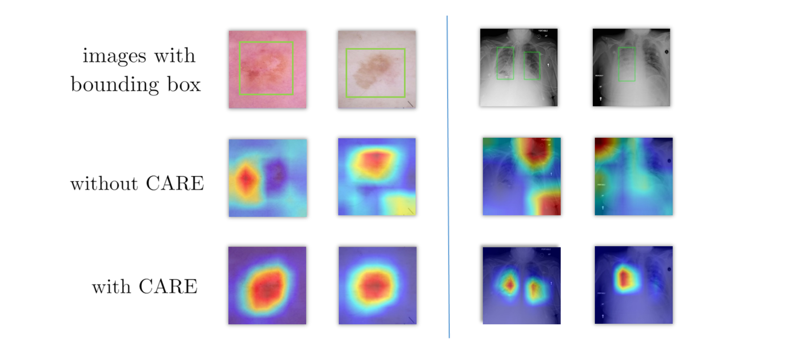
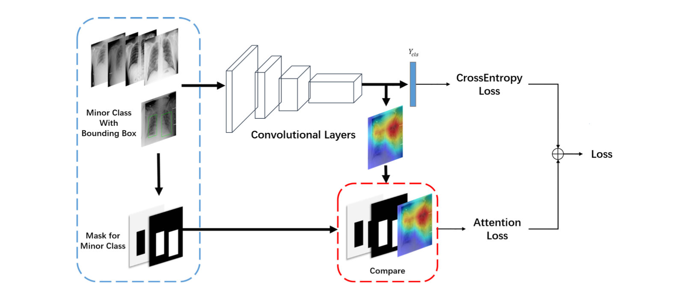

## CARE: Class Attention to Regions of Lesion for Classification on Imbalanced Data. (MIDL-2019)
***

by Jiaxin Zhuang, Jiabin Cai, Ruixuan Wang, Jianguo Zhang and Wei-shi Zheng.

This repo contains the **official pytorch implemetation** for CARE. 

### News
* [2019/12/6] We would continue updating all the codes in the near future.

### Motivation



### Framework  




### Requiements
* Python 3.6+
* Pytorch 1.3
* Cuda 9.2+ or Cuda 10.1+
* package required in requirement.txt
* Datasets & Masks (Download from our GoogleDriver).

### Dataset
Download from [OFFICIAL](https://challenge.isic-archive.com/data#2018)

### Installation

```bash
pip install -r requirement.txt
```


### Citation

```latex
@inproceedings{Zhuang2019CARE,
  author = {Zhuang, Jiaxin and Cai, Jiabin and Wang, Ruixuan and Zhang, Jianguo and Zheng, Weishi},
  title = {CARE: Class Attention to Regions of Lesion for Classification on Imbalanced Data},
  booktitle = {Proceedings of The 2nd International Conference on Medical Imaging with Deep Learning},
  month = {Jul},
  year = {2019},
  address = {London, United Kingdom}
}
```


## 
